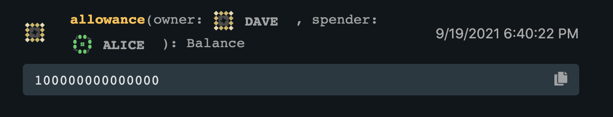

1.测试结果截图


2.合约编译截图


3.canvas-ui 合约内容截图


4.dave 授权 alice 可以从 dave 账号中抽取 100。
```shell
    allowance
        |->caller:dave,
        |->spender:alice,
        |->value:100
```


5.由于超出授权金额，所以 transfer_from 失败。
```shell
    transfer_from:
        Call from Account:alice
        |->dave - 105,
        |->bob + 105
        |-->{"err":"InsufficientApproval"}
```


6.由于未超出授权金额，所以 transfer_from 成功。
```shell
    transfer_from:
        Call from Account:alice
        |->dave - 100,
        |->bob + 100
        |-->{"ok":[]}
```
